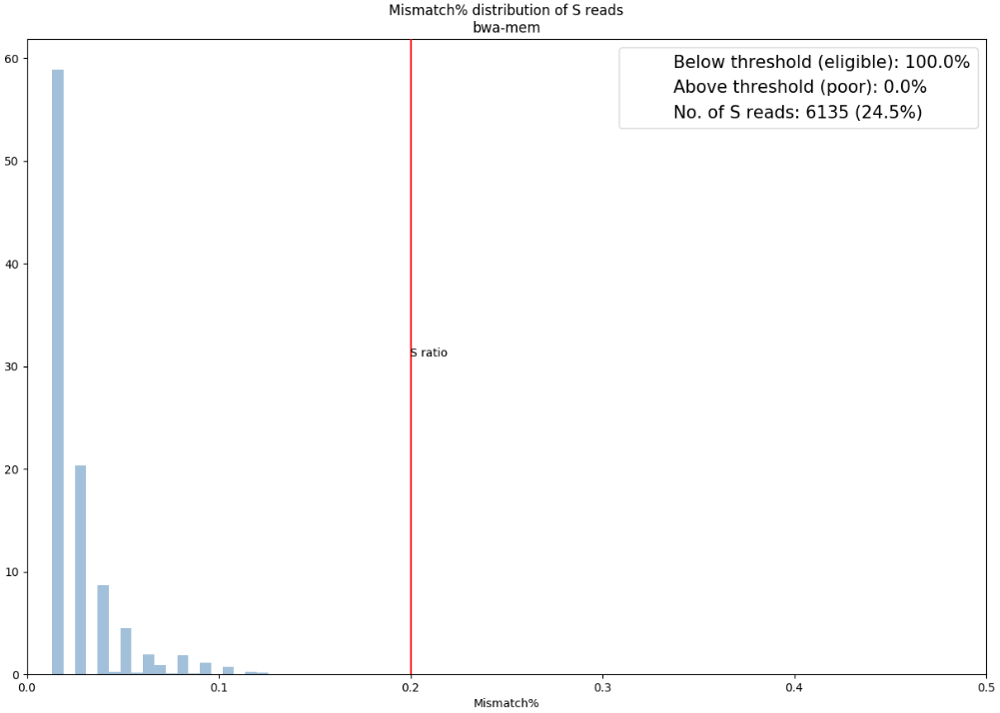
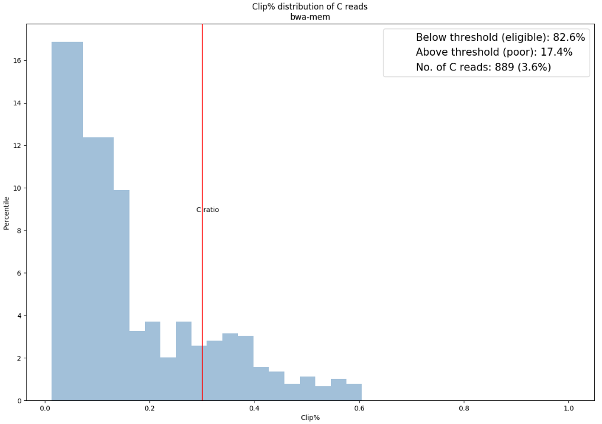

# Mismatch, Clip, and N Ratio

 

## Summary

In this section, we introduce **mismatch ratio**, **clip ratio**, and **N ratio** for S, C, and N reads respectively. It is worthy of note that SAM file does not support recording clip information for BWA-backtrack.

| Label | Description|
|:-:|:-:|
| P | Perfectly-matched reads |
| S | Reads with substitution errors |
| C | Reads that contain clips |
| O | Reads with other errors|
| M | Multi-mapped reads |
| F | Unmapped reads |
| N | Reads that contain N |

 

## Mismatch Ratio

If according to SAM file, a read can be mapped to reference assembly but with substitution errors, we then compute its mismatch ratio as follows,

	Mismatch ratio = No. of mismatch / read length

Reads whose mismatch ratio exceeds a specified threshold (default 0.3) will be determined poor quality.

SQUAT will plot the distribution of mismatch ratio for S reads in the report.

 
 

## Clip Ratio

If according to SAM file, a read can be mapped to reference assembly with clips marked on either side of the read, we then compute its clip ratio as follows,

	Clip Ratio = total length of clips / read length

Reads whose clip ratio exceeds a specified threshold (default 0.3) will be determined poor quality.

SQUAT will plot the distribution of clip ratio for C reads in the report.

 

## N Ratio
If a read contains at least one 'N', we can also compute its N ratio as follows,

	N Ratio = No. of N / read length

SQUAT will plot the distribution of N ratio for N reads in the report.

Reads whose N ratio exceeds a specified threshold (default 0.1) will be determined  poor quality.

